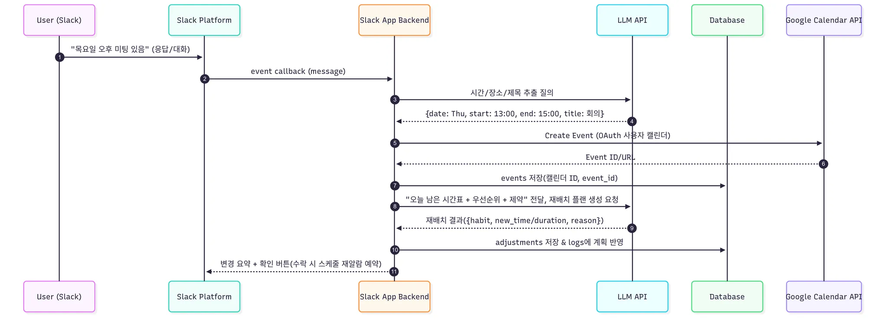

# 1. 개요

**앱 이름** : 해빗 트래커 에이전트 PRD   
**목적** : 솔로 프리너 개인에 맞는 생활 습관을 설정하고, 개인화 된 AI Agent를 통해 효율적인 습관 형성을 도와주는 서비스   
**타겟 사용자** : 프리랜서, 습관 형성을 원하는 개인   
**플랫폼** : 웹/앱 기반(슬랙, 노션, 구글 캘린더) MVP   

---

# 2. 목표

## 2.1 문제정의

솔로 프리너들은 직원 없이 혼자서 사업을 하는 1인 기업가를 의미합니다.
홀로 일하는 만큼 비정기적인 일정, 마감 등으로 인하여 업무의 맺고 끊음이 모호하고, 많은 업무량으로 인해 개인의 라이프 사이클이 무너지기 쉽습니다.

## 2.2 목표

솔로프리너 해빗 트래커는 개인이 설정한 생활습관을 상황에 따라 유연하게 제안하고, 변동성이 심한 상황에서도 생활습관을 유지할 수 있도록 하여 솔로프리너의 생산적인 라이프 사이클을 유지하도록 도와줍니다.

## 2.3 기존 방식

구글 캘린더 등 외부의 일정을 개인이 인식하고 생활 패턴을 컨트롤 하는 것이 일반적입니다.
업무가 몰리는 시기에는 개인이 유동적으로 일정들을 조절합니다.

## 2.4 기존 방식을 어떻게 해결할 수 있나?

- AI agent는 구글 캘린더 등에 추가되고 제거되는 업무들을 자동으로 참조합니다.
- 외부의 일정이 많을 때에는 습관의 우선도 순위와 사용자의 달성률에 따라 목표를 유연하게 조정합니다.
- 외부의 일정이 한가할 때는 보다 엄격한 조건을 사용하여 습관 달성률을 평가합니다.
- 사용자가 직접 목표의 달성률을 계산하는 것이 아닌, 주/월/년 단위의 자동 달성률 계산을 통해 사용자의 편의성을 도모합니다.

---

# 3. 요구사항

## 3.1 스택

- Slack App
- 저장소 (Postgres / SQLite)
- LLM (Gemini / GPT / Claude)
- 스케줄러 (n8n)
- 노션
- 구글 캘린더

## 3.2 기능

### 3.2.1 사용자 등록/수정

1. 설정값이 등록되어있지 않다면 자동으로 수행, 기존의 설정을 변경할 예정이라면 사용자가 setup 명령어 입력
2. LLM이 습관 입력을 요청. 사용자는 우선순위를 가진 습관들을 입력
3. LLM이 업무시간/알람간격/방해금지 시간 요청
4. DB에 사용자 프로필과 습관이 저장됨

### 3.2.2 루프

1. 알람 트리거 (설정한 알람간격마다)
2. 사용자 응답
3. LLM 처리
    
    **3.2.2.1 LLM 처리 후속 액션**
    
    1. 사용자 응답에서 정보가 부족할 경우 추가적인 정보를 요청
    2. 일정의 변동이 있을 경우, 목표 기준을 완화 또는 강화
    3. 남은 목표 업데이트

### 3.2.3 아침 요약

1. 저녁 방해금지 시간 이후 알람
2. 사용자 응답
3. LLM 처리
4. Notion에 일별 완료율/실패율 업데이트
5. 구글 캘린더 참조
6. 사용자에게 일정과 목표 정리

### 3.2.4 주간/월간 요약

1. Notion 및 DB에 저장된 데이터들을 종합
2. 리포트 작성 후 슬랙으로 알람

---

# 4. MVP 플로우

1. 사용자에게서 기본적인 설정 값을 받아오고, 이를 DB에 저장
2. LLM이 DB에 저장된 값을 기반으로 잘 응답하는지 확인
3. 스케쥴러가 정해진 시간마다 메세지를 출력하는지 확인
4. DB에 저장된 사용자의 응답이 Notion 보고서 형태로 출력되는지 확인

---

# 5. 테스트 및 검수

1. 입력 검수 : 사용자가 관련 없는 이야기를 할 경우 고려하지 않는지 확인
2. 처리 검수 : LLM의 요약이 사용자의 스크립트와 동일한지 확인, 부족한 정보에 대해서 재요청하는지 확인
3. 출력 검수 : 노션 탬플릿에 맞게 출력되는지 확인
4. 행동 검수 : 정해진 시간마다 슬랙 메세지 출력을 확인

---

# 6. 성공 지표

- 습관 별 완료율
- 사용자 유지율
- 알람 응답률
- 평균 연속 성공 일수

# 7. 시나리오 다이어그램

**초기 설정 : 습관/알람/업무시간 등**

**주기적 체크인 알람 & 응답 파싱**

**LLM 후속 액션**

**노션 동기화**

**아침 리마인더**

아래와 같이 노션으로 시각화하는 방법에 대해서 고민이 필요할 것 같아요.. @all   
[노션 습관트래커로 루틴 시각화하기(+달성률 수식)](https://gongysd.com/visualize-routines-with-notion-habit-tracker?srsltid=AfmBOorWYLQQMkNAdNjyZRS5MUFBG3GUyoI2ZBNrvGJFZxa8jdzzJ4xi)

- 시뮬레이션 하기 위한 적당한 예는 어떤 것이 있을까요?   

**1. 아침에 일어나서 물 한 잔 마시기**
가장 간단하지만 건강에 매우 이로운 습관이다. 밤새 쌓인 노폐물을 배출하고 신진대사를 활발하게 하는 데 도움을 준다.

**2. 매일 15분 이상 책 읽기**
지식과 교양을 쌓는 것은 물론, 디지털 기기에서 잠시 벗어나 뇌를 쉬게 하고 집중력을 높이는 데 효과적이다.

**3. 하루 7,000보 이상 걷기**
일상 속에서 쉽게 실천할 수 있는 유산소 운동이다. 신체 건강 증진은 물론, 스트레스 해소와 기분 전환에도 좋다.

**4. 아침 식사 챙겨 먹기**
하루를 활기차게 시작하는 데 필수적인 습관이다. 규칙적인 식사는 건강한 신체 리듬을 유지하는 데 도움을 준다.

**5. 하루 한 번, 5분 명상하기**
복잡한 생각과 감정을 정리하고 마음의 평온을 찾는 시간이다. 스트레스 관리와 정신 건강에 긍정적인 영향을 미친다.

**6. 잠들기 1시간 전 스마트폰 보지 않기**
전자기기에서 나오는 블루라이트는 수면 호르몬인 멜라토닌 분비를 억제하여 숙면을 방해한다. 질 높은 수면을 위해 꼭 필요한 습관이다.

**7. 하루를 마무리하며 감사한 일 3가지 적기**
일상 속에서 긍정적인 측면을 발견하고 감사하는 마음을 갖는 것은 정신적 풍요로움을 가져다준다.

**8. 정해진 시간에 잠자리에 들고 일어나기**
규칙적인 수면 패턴은 신체 리듬을 안정시키고, 만성 피로를 줄이며 전반적인 건강 상태를 개선하는 데 매우 중요하다.

**9. 하루 30분, 주변 정리 정돈하기**
어질러진 책상, 정리되지 않은 침구 등 주변 환경을 정리하는 것은 마음을 차분하게 하고 집중력을 높이는 데 도움을 준다.

**10. 내일 할 일 계획 세우기**
잠들기 전, 내일의 계획을 미리 세우면 다음 날을 더 체계적이고 효율적으로 보낼 수 있으며, 불필요한 불안감을 줄일 수 있다.